# Outsource

Please find live version of this app [here](https://outsource-rails.herokuapp.com/)

# Install **instructions for local server**

1. Clone this repo.

     `> git clone git@github.com:hannahgmacca/outsource.git`

2. Run Bundle install to install all gems.

     `> bundle install`

3. Rake db:setup to create local database migrate and seed.

    `> rails db:setup`
    `> rails db:migrate`
    `> rails db:seed`

4. Run the rails server.

     `rails s`

5. Load [http://localhost:3000/](http://localhost:3000/) in the browser.


### Seeded Data

There are three user accounts and a few tasks seeded for demonstration/testing purposes.

Their credentials are:

```ruby
ADMIN LOGIN
Hannah McDonald
Email: company@email.com
Password: password
(Has a few tasks posted)

NON ADMIN LOGINS
Ella Scott
Email: user@email.com
Password: password
(Has one task posted)

Stacey Schwenk
Email: user2@email.com
Password: password
(Has one task posted)
```

# Overview

Outsource is an app that brings users who want to find work together with users who need a job completed. It is a platform that allows users to search for jobs that interest them. They can filter tasks based on categories in order to find the right task for them.

Sourcing work can be difficult, especially when you have a small task that needs to be completed quickly and is once-off. Hence why Outsource is designed for those who want to complete ***tasks.*** This implies the nature of the work being outsourced as short and infrequent.

It removes the barriers of communication between taskers and taskees. Application forms allow task posters to see who is interested in their task, and give them instant approval or rejection. By having simple features of interaction such as comments and applications, users can interact with each other and get tasks completed.

**Why is this a problem?**

Many existing job boards exist to promote long-term and skilled employment. Sometimes we just need someone to wash our car because we just can't be bothered or don't have the time, let's leave the contracts out of it.

Outsource is a no-frills job app that only asks you to provide a small amount of information about yourself. The program is designed for low-risk jobs that need to be completed quickly. No need to write a cover letter to make money on Outsource.

This website promotes efficient and seamless communication between people who want jobs completed and people who want to complete jobs. We want Outsource to be the digital version of a community job board. This means a simple interface that promotes efficient and accurate communication in order to bring value to our users.

# Purpose

The purpose of Outsource is to provide a no-frills marketplace where users can post and find tasks to be completed. All areas of functionality within the app serve this one purpose.

The app serves to provide a platform where users can easily list and provide information about a new task. In turn, users can easily find and filter tasks based off their interests.

# Functionality

# Authentication

## Create / update account

User authentication is important as it ensures that the identity of a user is captured when they interact with the website. Upon landing, they will see the index page, all links to this page will route them to a user login page in order to authenticate them.

This is where they can enter their credentials such as email and password, and personal details such as their name and city.

If they wish to amend their details they may do so later on via the 'Edit profile' link from the dashboard.

# Authorisation

Admin roles allow Outsource resources such as comments and tasks to be externally updated and deleted. 

Outsource uses authorisation to ensure that each user is able to edit and delete tasks, comments, and applications that are created by them. Outsource implements authorisation in two ways:

1. Displaying links/buttons relative to the users privileges. Only an admin or the task, comment or application poster will see the edit and delete buttons when viewing that record.
2. Display error message if a user requests a record or action they are not authorised to complete. i.e if a user who did not create task1 tries to edit via the task/1/edit URL then they are redirected to the index page and given an alert.

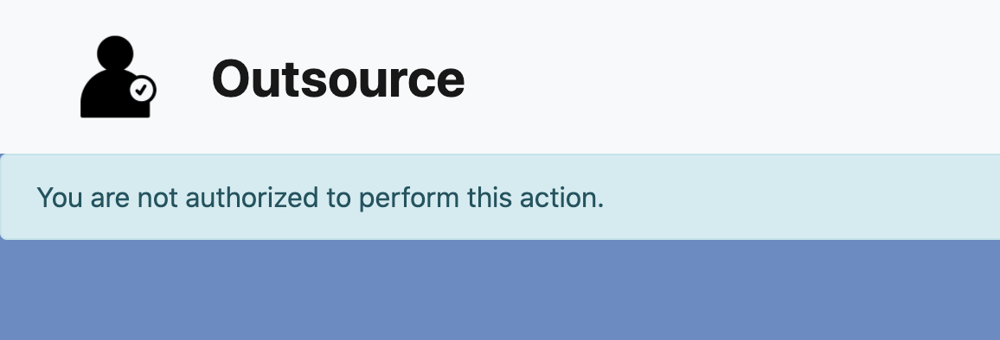

## Admins

Admin accounts are allowed to perform modifications on all tasks, comments and task applications in order to facilitate the management of Outsource.

An admin will be alerted of their status via the Admin badge on the dashboard.


# Dashboard

Users can find different parts of Outsource easily via the Dashboard.

This will be their main point of contact as it is where they can find all of the website links.


## Finish profile alert

If a user is missing either a profile picture or their 'About Me' section then the dashboard will list this as an alert on the dashboard.

# Profile

## Picture & About me

Users have the option to give outsource additional personal information. This information will be seen by other users and is what will bring their personalities to the app. 

The profile picture will be seen whenever they comment, apply for a task or another user visits their profile.  

# Tasks

## Create

From the dashboard, a user can create a new task. Entering details about it such as description, if it can be completed from home and the date they wish for it be completed on.

A user can categorize the task they are posting, using a set of dropdown options.

## View tasks

### Finding tasks from other users

By visiting the 'Find Tasks' link from the navbar, users can see a list of tasks available to be completed. From here they can 'View' or 'Apply' to the task.

### Filtering tasks

A user may filter the selection of tasks on this page from the dropdown menu at the top of the 'Find tasks' page.


### Task Pagination

The 'Find tasks' page is paginated so there is a maximum of 3 tasks per page, the user can navigated these pages using the yellow page linkbar at the top and bottom of this page.


### Finding tasks they posted

From the dashboard, a user can quickly view, edit or delete their active tasks.  


## Favourite

As a user is viewing tasks from the index page, they are able to quickly favourite them. This allows them to view the task later if they aren't ready to apply just yet. 

A user can visit tasks they have favourited via the 'favourites' button in both the nav bar and dashboard.

## Comment on

If a user has a question for the Task poster, they can comment on the Task post. 

Other users will be able to see this comment when they visit the task, but cannot delete or edit them.

The ensures that frequently asked questions can be posted for all other users to see.

A comment can be deleted by the comment poster and an admin.

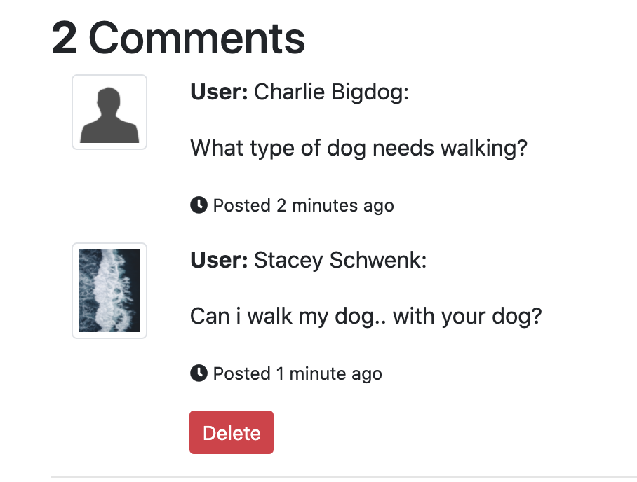

# Applications

## Send an application

Users who have interest in a task can choose to send an application. This application will be linked to their account and allows them to attach a message to the task poster.

### Prevention of multiple applications from the same user

When user is viewing tasks the 'Apply' button will instead show 'Applied', and if they attempt to reapply through entering in a URL that takes them to the apply page again they will be shown an error message. 


## View applications sent

Users may view a list of applications they have sent via the 'Applications' link on their dashboard.

Each application will show a status of Pending Approval, Approved or Declined.

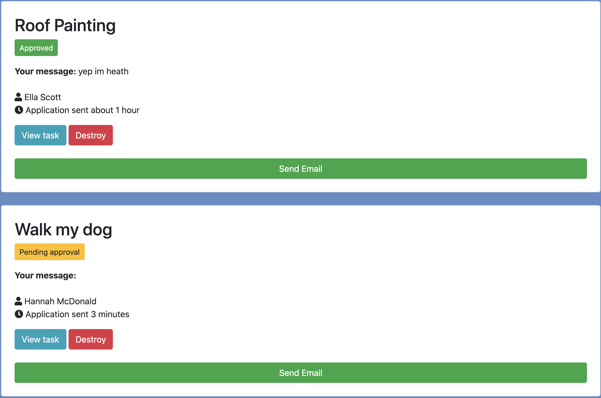

## Contact Task poster

If an applicant wishes to directly contact the task poster, they may do so once an application has been submitted (via the 'Send Email' button). This is so that common questions are posted in the comments section of the Task listing (i.e task/1) for other users to see.

## View applications received

Task posters can view applications from other users that wish to complete the task they have posted. These tasks are accessed via the 'To be Reviewed' button from the dashboard.

The user will be able to see if they have any applications sent to them that are pending review as there is a badge count on the button. 


### Approve

By selecting the green 'approve' button, they will be taken to the user that sent the application. This will then set the task as 'sourced', and will mean that task is no long advertised to other users.

Any other users who have applied to this task will see their application as 'declined' via their applications page. 

### Decline

By selecting the red 'decline' button, an application is set to declined . The applicant can see the declined status of their application from the applications page.

# Sitemap


# Screenshots

## Sign up


## Login


## Index


## Dashboard


## New task

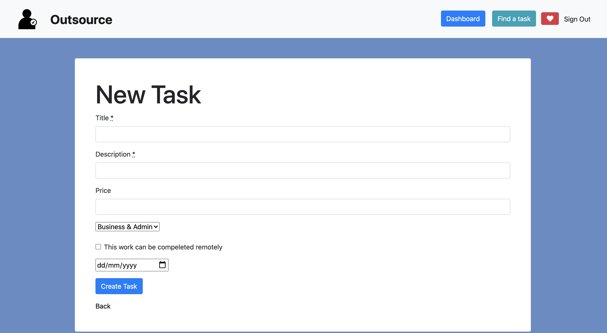

## Create task application


## View task


## View Applications


## View Favourited tasks

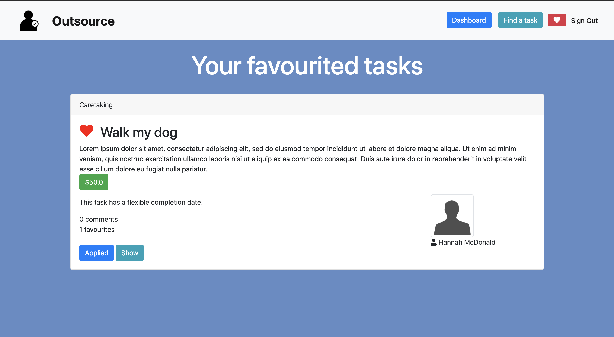

## Edit user profile


# Target Audience

Because of the two-sided functionality of Outsource, the target audience can be divided into two types. The first being the task posters and the second completers.

### Task Posters

Task posters are those who want a job completed for them. The demographic of the task posters are those who are time, energy or skill poor and wish to find someone else that can do the job for them. 

Often a task poster is someone of higher economic background. Often working in their own highly skilled career makes them time poor and therefore they are more likely to outsource. 

On the other hand, a task poster may also be someone of disadvantage or lower economic background. They may be posting a task due to lack of skill or ability. This could be stemmed from disability or education.  

Therefore the demographic of task posters varies widely depending on the reason they need a task completed. But we can assume they would be someone between the age of 18 - 50, as children do not need mundane tasks completed, and older people statistically have the time and skill required to complete it themselves.

### Task Completers

Task completers are the users who wish to find quick work. The demographic of task completers might be of a lower economic background, as completing quick and unskilled work is a great way for them to make money even if they do not have professional experience or skills.

They may also have a niche skill that is unusual, and struggle finding businesses to hire them based off this specific skill. Outsource allows them to be their own boss and find their own clients. This could be a job like 'Sell my clothes on Ebay for me' or 'Organise my wardrobe'. Niche skills like this work great on Outsource, as they are often a once off task and require a unique interest or talent from the task completer.

# Tech Stack

### Application & Data

- **HTML**: Used in the View to define what the user will see and how they will see it
- **CSS**: Used to style HTML components for layout and aesthetics
- **Sass**: A CSS framework used by Rails 6 for cleaner and more functional CSS
- **Ruby on Rails**: Core logic and functionality is built using Ruby on Rails 6.
- **Javascript**: Used for event handling of the 'toggle favourite' feature (turns the heart pink)
- **PostgresQL**: Database used to store application data
- **Amazon Web Services (S3):** Cloud storage used to store user photos
- **Heroku:** Web server used for deployment
- **Bootstrap:** Library for for styling of views and user interface
- **Bootstrap forms:** Provides helper code for forms. Allowed me to implement a drop down filter for categories selection
- **Devise**: Implements user authentication through building the User model, login and sign up page. Devise provides a huge library that was used throughout Outsource for both authorisation and authentication.
- **JQuery:** A javascript library that Bootstrap uses for some of its functions such as dropdowns.
- Simple form: A library of Rails code that helps implement simple form building.
- **Acts a favoritor:** This allowed me to introduce favouriting of tasks with simplicity. The gem is well built and tested so was a great solution for adding this feature into Outsource.
- **Font awesome:** For icons used.
- **Pundit**: For user authorisation as it provides a library that allowed me to define the 'policy' of records within Outsource. i.e a Task Policy allowed me to declare that only the task poster or admin have edit / delete privileges of a task.
- **Kaminari:** For paginating 'Find a task' pages so that only 3 tasks are listed per page.

### DevOps

- **Git:** Used for version control management on local repository and to communicate to GitHub
- **GitHub:** For hosting of remote repository for version control management

### Business / Design tools

- Notion: General informal notetaking and recording of processes uses throughout development for personal use
- Trello: Task management
- Figma: Wireframe design
- Discord: Communication with peers and teachers

# Design

## User Stories

### Ella

As a task poster, I want to be able to easily post a new task and include important details such as description, completion date, category, and payment details. This is so that I can share the details about exactly what i want done and therefore find the right person to complete it.

### Stacey

As a task poster, I want to be able to easily see what applications I need to review so that I don't miss any opportunities for my task to be completed. I want to be able to approve these applications so that I can quickly let the other user know if they are who I am looking for or not. This ensures that I can let the right person know that i want them to complete the task I have posted.

### Heath

As a task completer, I want to be able to easily find and view what tasks are available to be completed so that I don't miss any opportunities to find the right task.

### Ashleigh

As a task completer, I want to be able to easily filter what tasks are shown to me based off their categories. This is so that I can find the right task that best fits my skills and interests.

### Matt

As a task completer, I want to be able to easily send an application to a task poster and give them more information about myself that is specific to the task requirements. This is so that task posters can see why I am fit for the job and consider me as a successful applicant.

### Jennifer

As a task completer, I want to be easily able to favourite tasks and view them later. This is so that I can keep track of tasks that I am interested in without applying for them straight away.

### Alex

As both a task poster and task completer, I want an easy to use navigation that allows me to find new tasks, view applications and also manage tasks I have posted myself. This will allow me to be efficient and avoid confusion as I use the app.

### Milo

As a task completer, I want to be able to publicly comment on tasks so that I can interact with the poster and ask questions about the job. This will make tasking seeking simpler as another user may have already asked a similar question.

### Ava

As a task poster, I want to be able to easily decline or approve applications that are sent to me. This is so that I can quickly tell applicants that they aren't fit for the task or let them know that I have sourced them for the job.

### Max

As a task completer, I want to easily see the status of the applications I have sent. This is so that I know if the task poster is yet to review my task, or has declined/approved it. 

### James

As an admin, I want to easily delete or update tasks/comments posted so that I can manage user activity. 

## Wireframes

Link to the full page of wireframes:

[https://www.figma.com/file/23lexNNdO8xW3zmtwtaxod/Lo-fi-Wireframe-Kit-Community?node-id=11%3A2018](https://www.figma.com/file/23lexNNdO8xW3zmtwtaxod/Lo-fi-Wireframe-Kit-Community?node-id=11%3A2018)

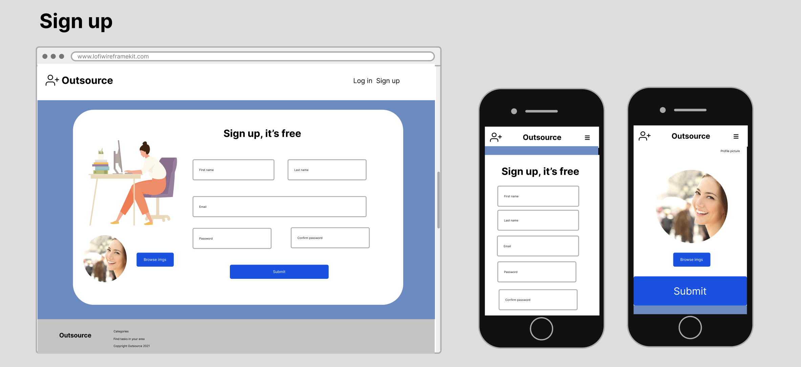

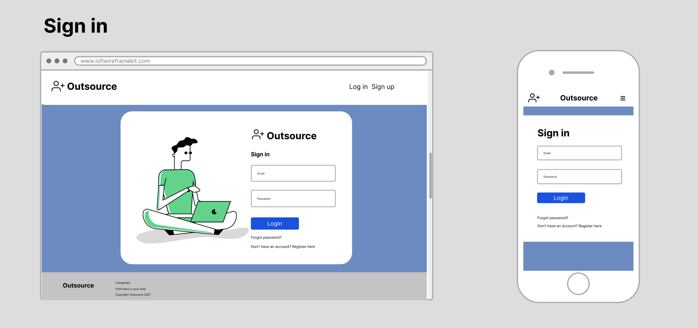


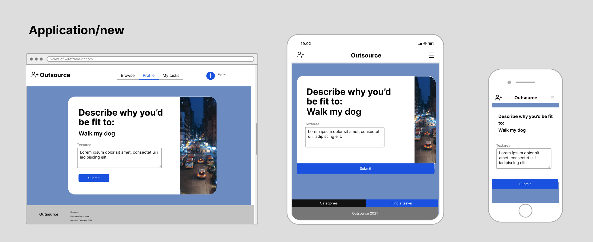

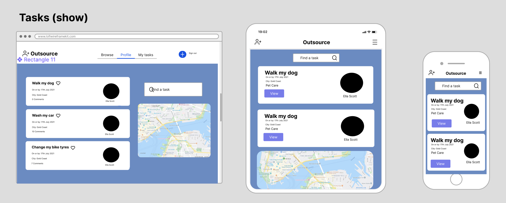

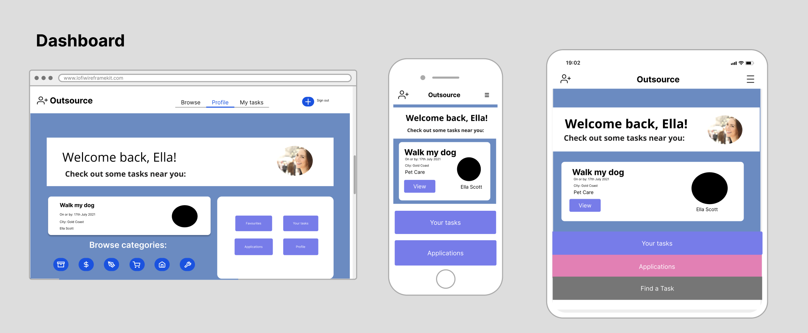


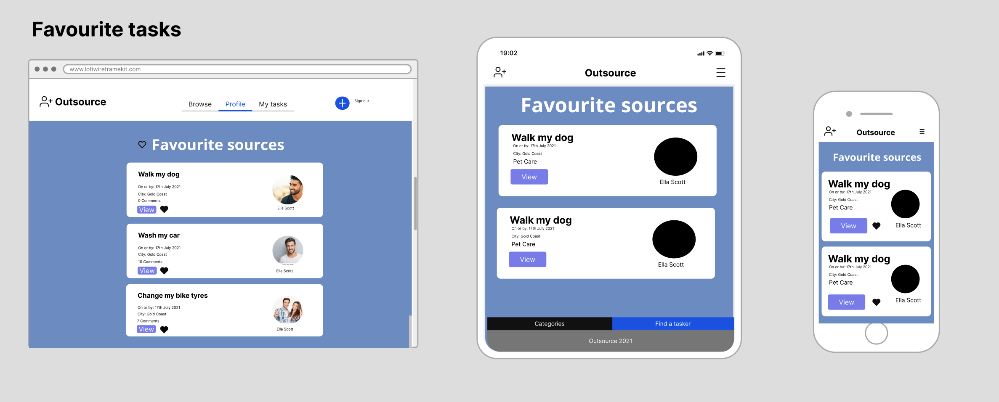


## Entity Relationship Design

The initial design of the ERD included entities such as Payment, TaskComplete, City and Skill.

During development, the need for a **TaskComplete** model felt unnecessary. This is because the task status of 'sourced' and task application of 'approved' would allow the app to naturally track associations between task posters and completers. As Outsource grows in tasks and users, the additional data in TaskComplete would be a waste of storage.

**Payment** was also not implemented as the user to user interface of Outsource didn't require a payment gateway. This feature may be added in future versions of the application.

Both **City** and **Skill** were also not used in the final design. User skill didn't feel like it added a lot of value to the app during the first release due to categories already allowing users to find tasks that suit them, but again might be implemented in future versions.

**City** was not used as there is no location features implemented in the first release of Outsource. For future updates, the gem Geocoder will be implemented and the user's locations will be tracked via their IP address sent in HTTP requests as they access the website.

**Initial ERD**


**Final ERD**


# Model View Controller

## Model

Outsource models are used to define what entities are tracked in the application, what information is tracked and how they relate to one another. 

This is important as it provides a solid data structure that manages the data that is being stored in the application. 

The ERD shown in the previous section is a diagram of how the Models are structured in Outsource. The key aspects being what models are tracked, the data types of their attributes and the relationships that exist between them. 

Each model has a corresponding View and Controller, so it is important that the data is logically divided based on role in the application. 

## Controller

The controllers in Outsource are responsible for defining the logic used in the application. Whenever a user makes a request such as 'New task', 'View task', or 'Post comment', it is the responsibility of the controller to feed information to the view based on the structure it can see in the model.

Below are a few examples of the MVC components interacting with each other: 

**Task MVC**

For example, the tasks view can only list available tasks to the user because of the logic in the TaskController querying data using the data structure from the TaskModel. 


Here we see the TaskController index method checking if a user has filtered the task search to show by category. 

If they haven't, then the controller sends an array of tasks to the "/tasks" (AKA the View) from the task model where:

- The user ID doesn't match the user ID in the task entry (so we know they aren't viewing tasks they created).
- The sourced attribute of the task is either nil or false

If the user has filtered the task search, then it completes the above query but also only pulls tasks that have the same category as the one the user is looking for. Both of these arrays use the Kaminari gem to paginate them in the view and show only 3 tasks per page (hence the .page)


Another example of the Task Controller logic is the destroy method called when a user attempts to delete a task. Task policies define that a user can only delete or modify a task if they are an admin or they posted it. The TaskController uses this policy to check this before they task is deleted, ensuring user authorisation is implemented. 

The controller uses the data structure from the model to ask the database, did this user post this task or are they an admin? If either one returns true then they tell the model to delete this entry and send information to the view to display a different page.

## View

The view is responsible for defining what the user will see and how they will see it. It is the interface that will allow them to interact with Outsource. For example, the users can only see tasks posted on the '/tasks page because of the instructions in the views/index page telling the browser to how show them to the user.


We can see here that the views is taking the array of @tasks from the controller#index based off the logic discussed before. The views doesn't have to worry if the user is filtering the search, it can just be handed the output data and will produce the result for the user. 

# Third-party Services

## Amazon Web Services

Outsource implements Amazon Web Services as cloud storage so that users have a reliable and secure way of uploading a profile picture. AWS is an alternative of active storage used and is much more scalable and secure than using local storage. Heroku also offers active storage as part of their hosting service but only a small amount. 

## Heroku

For deployment of Outsource, Heroku's website hosting service was used. Heroku offers a free hosting service for websites below a certain size and traffic amount. There are other free options similar to Heroku such as Github Page and AWS, but Heroku is the most compatible with the tech stack used to develop Outsource. Ruby on Rails and PostgreSQL databases are easily deployed and managed using Heroku.

# Data Structure

## Models

### Category

Represents a category type that a task can belong to. Categories are:

- Cleaning
- Delivery
- Removals
- Technology
- Business & Admin
- Tutoring
- Repair
- Finance
- Home & Garden
- Design & Admin
- Organising
- Food & Cooking
- Caretaking
- Misc

### Favourite

Represents an instance of a user favouriting/liking a task. It tracks which user and what task is being favourited.

### Comment

Represents a message being left on a task posting by a user. This model tracks who posted on the comment, on what task and what message they left.

### User

Represents a user's identity on the application. This tracks their login credentials such as email and password, and also personal information such as name, photo and about me.

***Why a UserInfo model was not used***

During the database design, a second model of UserInfo was considered. This model would have been where the personal information of users was stored. 

Because each user only has one user account, the UserInfo model was not used as it improved the simplicity and database efficiency of users within the app.

### Task

This represents a task that a user has added. This model tracks information about the task such as:

- title
- description
- price
- category
- the user who posted it
- if it is remote work
- if it has been sourced

***Why a CompletedTask model was not used***

Original database design included a CompletedTask model, which would track each completed task and the user who completed it.

With the implementation of Task Applications though, this felt inefficient. As a task is either complete or not complete, and an approved task application already tracks the information about the user who will be completing it. 

Therefore the attribute of 'sourced' allows the app to know if the task is being completed, and information about the user who completed it can be found through applications. This reduces the number of entries in the database and increases efficiency.  

### Task Application

Task application represents a user requesting to complete a task that another user has posted. The task application tracks which user is applying and what task, as well as a message from the applicant and if the application is approved or not. 

Outsource knows if the 'approved' attribute of this model is nil, then the task poster has not selected anyone to complete the task yet. 

## Active Record Associations

The models and their associations are listed below:

### User

- Has_many :tasks (the tasks they have posted for completion
- Has_many :comments
- Has_one_attached :picture
- Has_many task_applications, dependent: destroy
- Has_many :favourites (through being a *favoritor* - from ruby gem *acts_as_favoritable*)

### Task

- Has_many :favourites (through being a *favoritable* - from ruby gem *acts_as_favoritable*)
- Belongs_to :user
- Belongs_to :category
- Has_many :comments, dependent: :destroy
- Has_many :task_applications, dependent: :destroy

### Task Application

- Belongs_to :task
- Belongs_to :user.

### Category

- Has_many :task

### Favourite

- Belongs_to :favoritable (e.g task)
- Belongs_to :favoritor (e.g user)

### Comment

- Belongs_to :user
- Belongs_to :task

## Database Relations

### User (poster) & Task

Because a user can post many tasks but a task can only be posted by one user, this is a *one-to-many* relationship. 

The ERD displays this relationship through the **1-*** symbols.


### User & Comment

Because a user can post many comments, but a comment can only belong to one user, this is a one-to-many relationship.

The ERD displays this relationship through the ***-1** symbols.


### Comment & Task

Because a comment can only belong to one task, but a task can have many comments, this is a many-to-one relationship (same as one-to-many).

The ERD displays this relationship through the **1-*** symbols.

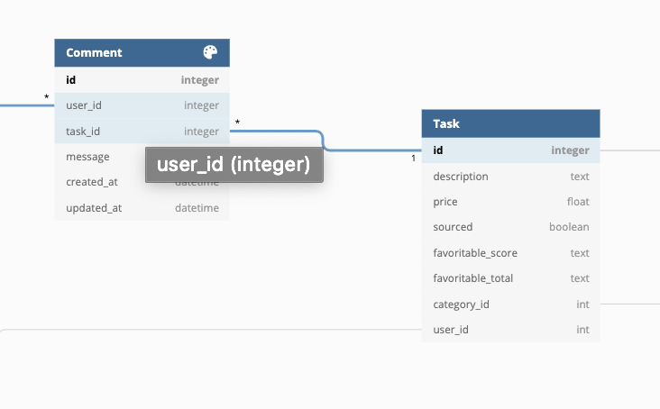

### User (task completer) & Task Application

Because a user can submit many applications, but an application can only be sent by one user, this is a *one-to-many* relationship.

The ERD displays this relationship through the **1-*** symbols.


### Task & Task Application

Because a task can have many applications for it but each application can only be sent for one task, they have a one-to-many relationship.

The ERD displays this relationship through the **1-*** symbols.


### User & Favourite

Because a user can have multiple favorite tasks, but each favourite can only be completed by one user, they have a one-to-many relationship.

The ERD displays this relationship through the **1-*** symbols.

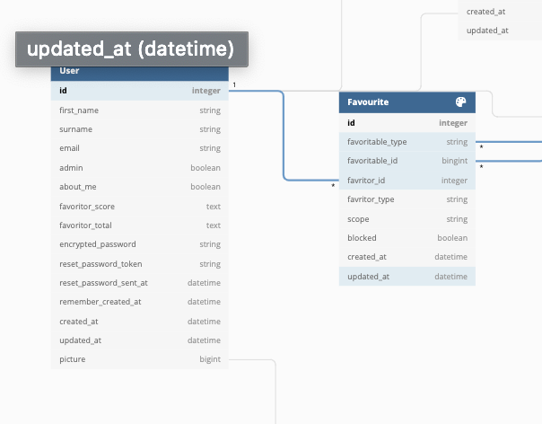

### User & Picture

Because a user can have only one picture attached and that picture is only attached to that user, they have a one-to-one relationship. 

The ERD displays this relationship through the **1-1** symbols.

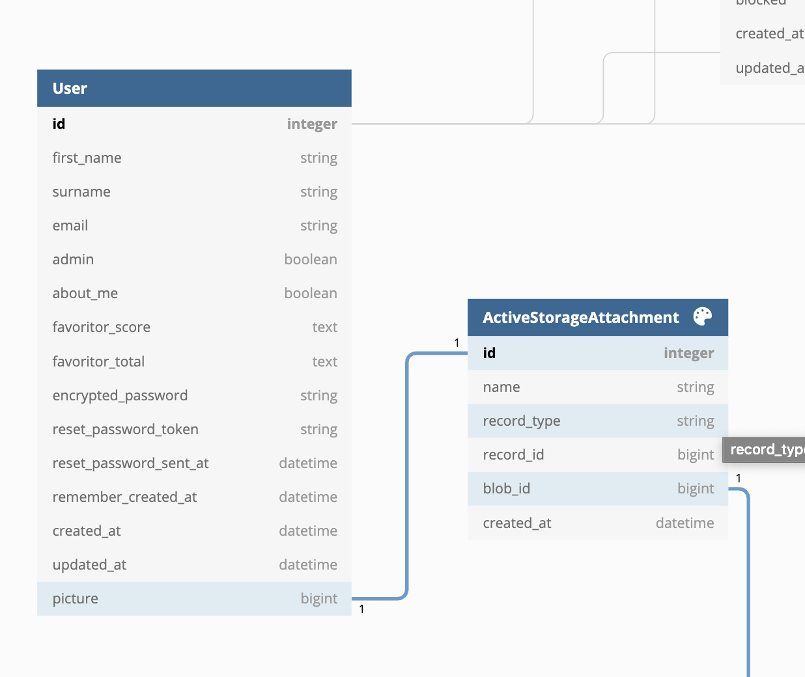

 

### Task & Category

Because a task can only belong to one category, but a category can have multiple tasks belong to it, they have a many-to-one relationship.

The ERD displays this relationship through the ***-1** symbols.


## Database Schema Design

```ruby
# This file is auto-generated from the current state of the database. Instead
# of editing this file, please use the migrations feature of Active Record to
# incrementally modify your database, and then regenerate this schema definition.
#
# This file is the source Rails uses to define your schema when running `rails
# db:schema:load`. When creating a new database, `rails db:schema:load` tends to
# be faster and is potentially less error prone than running all of your
# migrations from scratch. Old migrations may fail to apply correctly if those
# migrations use external dependencies or application code.
#
# It's strongly recommended that you check this file into your version control system.

ActiveRecord::Schema.define(version: 2021_08_03_053057) do

  # These are extensions that must be enabled in order to support this database
  enable_extension "plpgsql"

  create_table "active_storage_attachments", force: :cascade do |t|
    t.string "name", null: false
    t.string "record_type", null: false
    t.bigint "record_id", null: false
    t.bigint "blob_id", null: false
    t.datetime "created_at", null: false
    t.index ["blob_id"], name: "index_active_storage_attachments_on_blob_id"
    t.index ["record_type", "record_id", "name", "blob_id"], name: "index_active_storage_attachments_uniqueness", unique: true
  end

  create_table "active_storage_blobs", force: :cascade do |t|
    t.string "key", null: false
    t.string "filename", null: false
    t.string "content_type"
    t.text "metadata"
    t.bigint "byte_size", null: false
    t.string "checksum", null: false
    t.datetime "created_at", null: false
    t.index ["key"], name: "index_active_storage_blobs_on_key", unique: true
  end

  create_table "categories", force: :cascade do |t|
    t.string "title"
    t.string "description"
    t.datetime "created_at", precision: 6, null: false
    t.datetime "updated_at", precision: 6, null: false
  end

  create_table "comments", force: :cascade do |t|
    t.string "message"
    t.bigint "user_id", null: false
    t.bigint "task_id", null: false
    t.datetime "created_at", precision: 6, null: false
    t.datetime "updated_at", precision: 6, null: false
    t.index ["task_id"], name: "index_comments_on_task_id"
    t.index ["user_id"], name: "index_comments_on_user_id"
  end

  create_table "favorites", force: :cascade do |t|
    t.string "favoritable_type", null: false
    t.bigint "favoritable_id", null: false
    t.string "favoritor_type", null: false
    t.bigint "favoritor_id", null: false
    t.string "scope", default: "favorite", null: false
    t.boolean "blocked", default: false, null: false
    t.datetime "created_at", precision: 6, null: false
    t.datetime "updated_at", precision: 6, null: false
    t.index ["blocked"], name: "index_favorites_on_blocked"
    t.index ["favoritable_id", "favoritable_type"], name: "fk_favoritables"
    t.index ["favoritable_type", "favoritable_id"], name: "index_favorites_on_favoritable_type_and_favoritable_id"
    t.index ["favoritor_id", "favoritor_type"], name: "fk_favorites"
    t.index ["favoritor_type", "favoritor_id"], name: "index_favorites_on_favoritor_type_and_favoritor_id"
    t.index ["scope"], name: "index_favorites_on_scope"
  end

  create_table "task_applications", force: :cascade do |t|
    t.string "message"
    t.bigint "user_id", null: false
    t.bigint "task_id", null: false
    t.datetime "created_at", precision: 6, null: false
    t.datetime "updated_at", precision: 6, null: false
    t.boolean "approved"
    t.index ["task_id", "user_id"], name: "index_task_applications_on_task_id_and_user_id", unique: true
    t.index ["task_id"], name: "index_task_applications_on_task_id"
    t.index ["user_id"], name: "index_task_applications_on_user_id"
  end

  create_table "tasks", force: :cascade do |t|
    t.string "title"
    t.string "description"
    t.float "price"
    t.datetime "created_at", precision: 6, null: false
    t.datetime "updated_at", precision: 6, null: false
    t.bigint "category_id", null: false
    t.bigint "user_id", null: false
    t.text "favoritable_score"
    t.text "favoritable_total"
    t.boolean "remote_work"
    t.date "task_date"
    t.boolean "sourced"
    t.index ["category_id"], name: "index_tasks_on_category_id"
    t.index ["user_id"], name: "index_tasks_on_user_id"
  end

  create_table "users", force: :cascade do |t|
    t.string "email", default: "", null: false
    t.string "encrypted_password", default: "", null: false
    t.string "reset_password_token"
    t.datetime "reset_password_sent_at"
    t.datetime "remember_created_at"
    t.datetime "created_at", precision: 6, null: false
    t.datetime "updated_at", precision: 6, null: false
    t.string "first_name"
    t.string "surname"
    t.text "favoritor_score"
    t.text "favoritor_total"
    t.boolean "admin", default: false
    t.string "about_me"
    t.index ["email"], name: "index_users_on_email", unique: true
    t.index ["reset_password_token"], name: "index_users_on_reset_password_token", unique: true
  end

  add_foreign_key "active_storage_attachments", "active_storage_blobs", column: "blob_id"
  add_foreign_key "comments", "tasks"
  add_foreign_key "comments", "users"
  add_foreign_key "task_applications", "tasks"
  add_foreign_key "task_applications", "users"
  add_foreign_key "tasks", "categories"
  add_foreign_key "tasks", "users"
end
```

# Task Management

Tasks were organised by using the task board app Trello.

You can view my full Trello board and tasks [here](https://trello.com/b/hYUtKxVp/outsource)

### Functions

It began with identifying and defining the functions of Outsource, based on the user stories already developed.

For example: 

### Ella

As a task poster, I want to be able to easily post a new task and include important details such as description, completion date, category, and payment details. This is so that I can share the details about exactly what I want to be done and therefore find the right person to complete it.

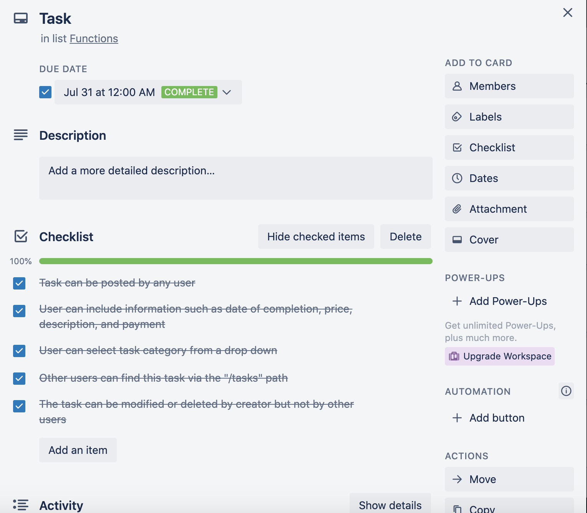

Based on the use cases that exist in the user story Ella, I was able to document and prioritise this function as this was an important user story.

Another example of task management lead by user stories:

### Jennifer

As a task completer, I want to be easily able to favourite tasks and view them later. This is so that I can keep track of tasks that I am interested in without applying for them straight away.

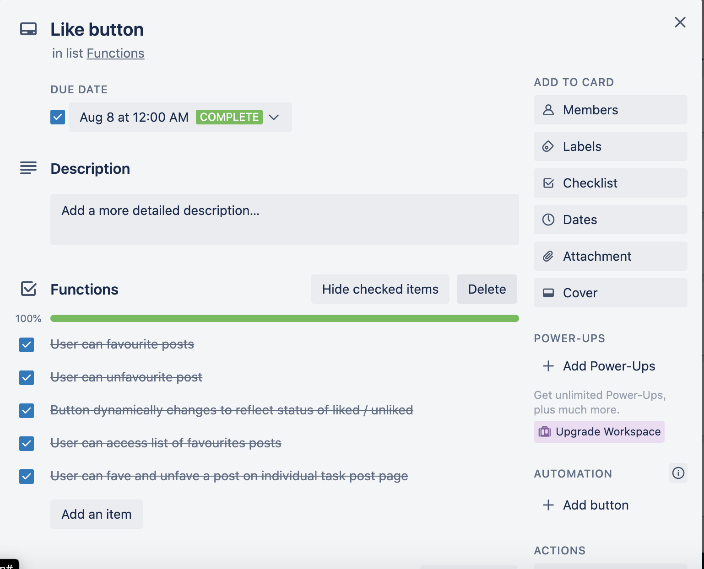

Once functions were completed, they were labeled and given due dates based on importance.


The functions allowed me to then identify what models would be needed and I developed my ERD. From my ERD I was able to break up the application into models, so I wanted to organise the setup of my models and their associations.

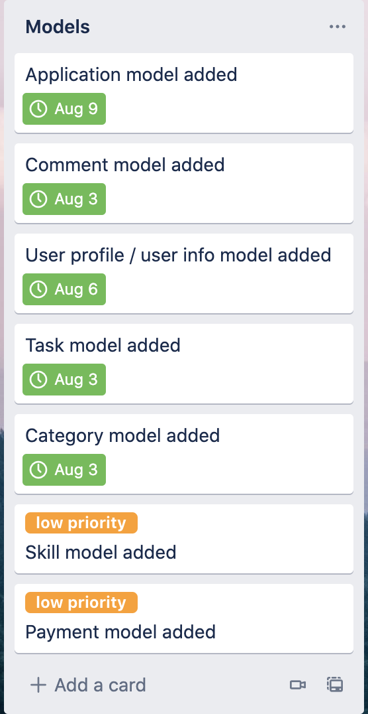

### Design

Because I am very front-end design orientated, it was critical for me to set deadlines for the wireframes so I knew what I needed to be done. This allowed me to limit myself in time spent making design choices so I wouldn't get carried away.


I also documented any functions that seemed very low priority through additional features. These were almost there as a reminder of what else Outsource could become.

 


### Backlog

Finally, development revealed many ongoing tasks that needed to be documented so I could come back to them and complete them. These were often small changes to do with layout or something very important but didn't quite belong to a feature. 

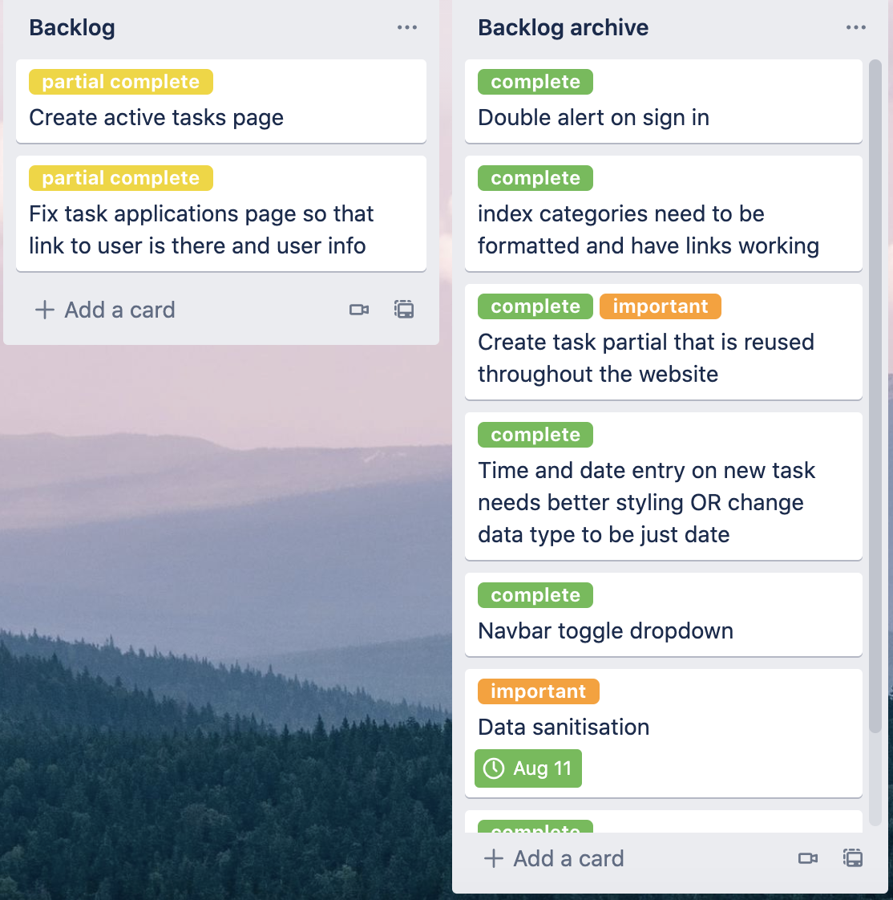